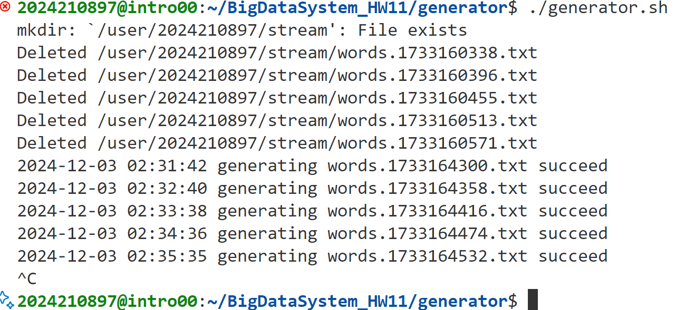
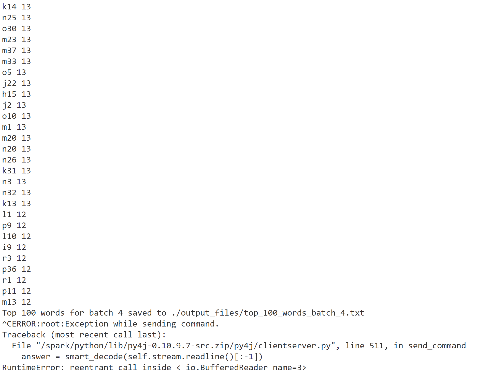

# 实验报告-HW11
## 文件结构
```
BIGDATASYSTEM_HW11
├── report.md
├── report.pdf
├── generator
└── simple_app_python
    ├── SimpleApp.py
    ├── log4j.properties
    ├── submit.sh
    ├── output_files
    └── stream
```
* `report.md`: 实验报告
* `report.pdf`: 实验报告PDF版本
* `generator`: 生成数据的脚本文件夹
* `simple_app_python`: Spark Streaming应用程序文件夹
  * `SimpleApp.py`: Spark Streaming应用程序
  * `log4j.properties`: log4j配置文件
  * `submit.sh`: 提交Spark应用程序的脚本
  * `output_files`: 输出文件夹（存放应用程序5分钟内依次输出的文件）
  * `stream`: 流数据文件夹（存放5分钟内产生的原始Streaming数据，从`hdfs`中拷贝得到）

## 运行方式
生成数据流：
```bash
cd generator
./generator.sh
```
获取结果：
```bash
cd simple_app_python
./submit.sh
```

## 代码逻辑
在原有程序基础上，首先通过`getpass.getuser()`获取当前用户名，得到待监听及存储检查点的`hdfs`文件路径；然后使用`DStream`的`updateStateByKey`方法，对每个`word`进行累积计数；最后使用`foreachRDD`方法，借助自定义的`get_top_words`函数，输出每个`batch`的`top 100`单词并将其存入文件。

## 实验结果
实验结果存放在`simple_app_python/output_files`文件夹中，每个文件对应一个`batch`的`top 100`单词；存放于`simple_app_python/stream`文件夹中的`stream`文件为拷贝自`hdfs`的原始数据流，可用于检查程序是否正确运行。具体控制台输出结果截图如下：
数据生成器：

Spark Streaming应用程序：
